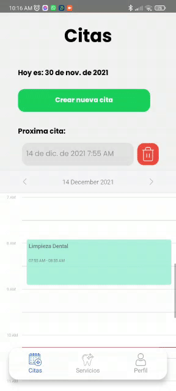
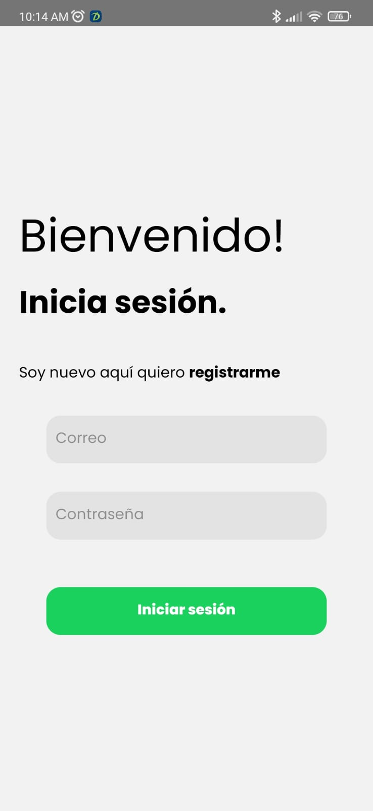
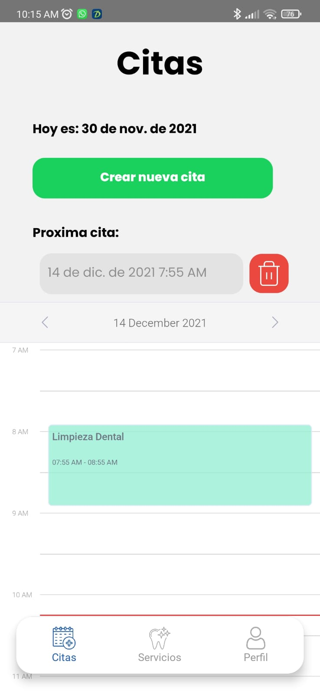
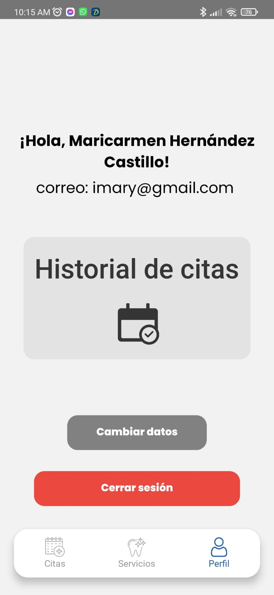
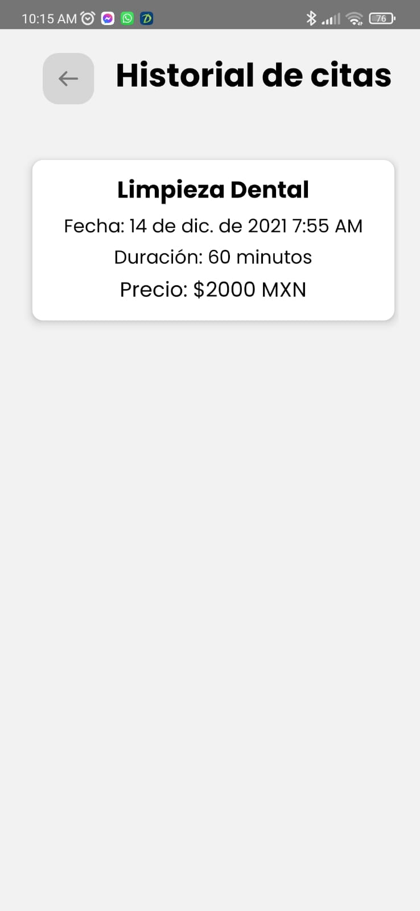
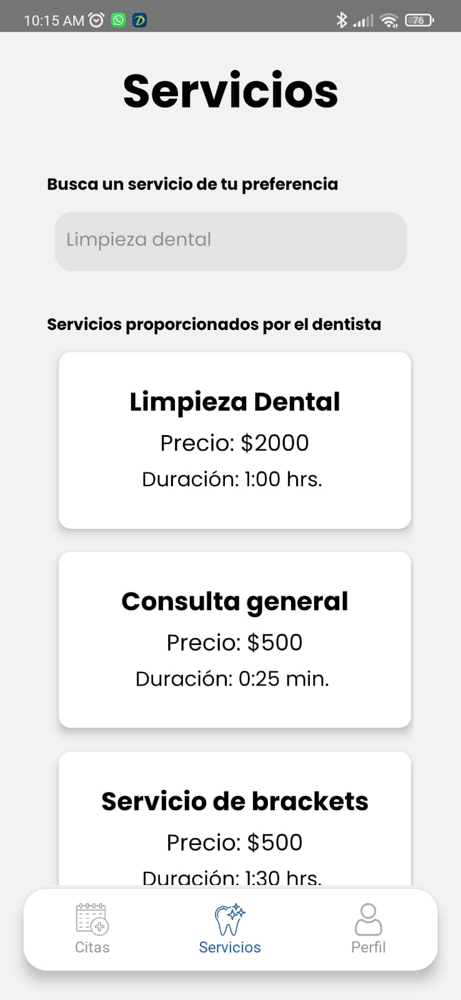

"Mi dentista" Is an app that will help us to control the appointments, patience, assistants, services and unavailable dates in a dental office.

The tech stack used was:

- Back end - Python
- Front end web - React/Redux (PWA)
- Mobile - React native

---

## Example

## Login

## Appointments

## Profile

## History

## Services

